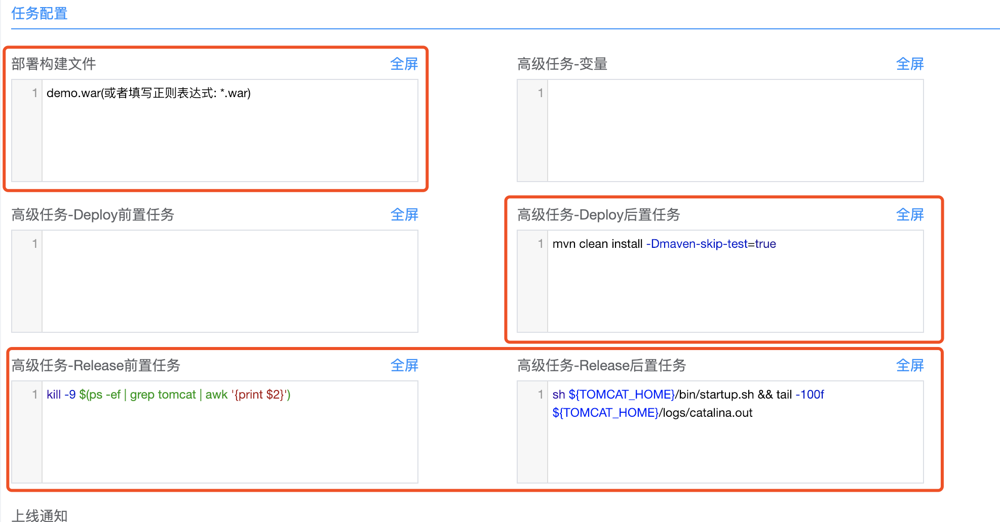

title: Java项目配置模板
---
## 配置Java、maven环境
   **根据自己的项目选择相应的jdk、mvn版本号，这里选择jdk1.8**
   下载JDK、Maven：
   ```html
    JDK： 
        https://www.oracle.com/technetwork/java/javase/downloads/jdk8-downloads-2133151.html
    MAVEN：
        http://ftp.tsukuba.wide.ad.jp/software/apache/maven/ 
```
   将下载的文件保存在/usr/local/目录下。
   **添加环境变量**
   将下面内容添加至/etc/profile文件最后
   ```bash
   # setting jdk maven
    export JAVA_HOME=/usr/local/jdk1.8
    export JRE_HOME=/usr/local/jdk1.8/jre
    export M2_HOME=/usr/local/maven
    export CLASSPATH=.:${JAVA_HOME}/lib/dt.jar:${JAVA_HOME}/lib/tools.jar:${JRE_HOME}/lib
    export PATH=${JAVA_HOME}/bin:${JRE_HOME}/bin:${M2_HOME}/bin:$PATH
```
   **生效配置文件：source /etc/profile**
   **修改Maven仓库：sudo vi ${M2_HOME}/conf/setting.xml**
   ````xml
   <mirrors>  
    ...   
    <mirror>  
      <id>aliyun-maven</id>  
      <name>aliyun maven</name>  
      <url>http://maven.aliyun.com/nexus/content/groups/public/</url>  
      <mirrorOf>central</mirrorOf>          
    </mirror>
</mirrors>
````
   
## 新建项目
   **JAVA软件项目,图片中的配置根据自己需求更改**
   
   
   
## 其他软件工程陆续会新增，请耐心等待

感谢[李庆海@麦子金服](https://extp.org/)出品
